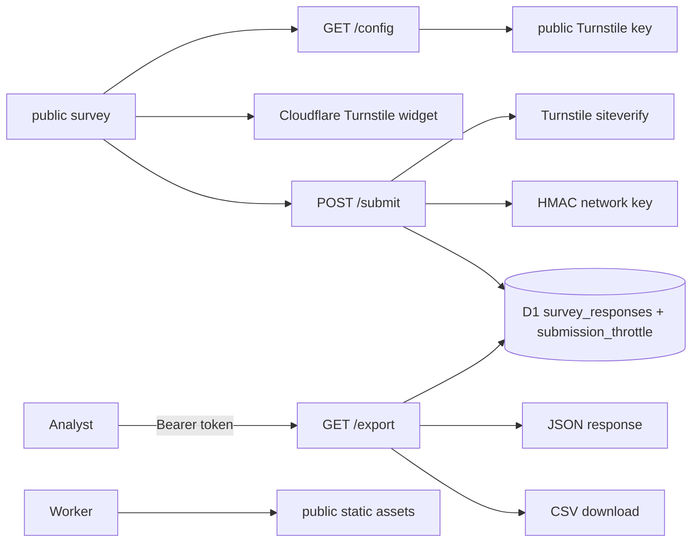

# South African Economic Pressure Survey Technical Documentation

## System overview

This project is a Cloudflare Worker that serves a static anonymous survey and persists validated responses in D1. The Worker runs before static assets, routing `/submit`, `/export`, and `/config` itself and forwarding other GET/HEAD requests to the `ASSETS` binding with security headers. Turnstile protects submissions, an HMAC-derived network key and D1 throttle table limit abuse, and a bearer-token export endpoint returns JSON or CSV.



## Worker and frontend boundaries

`src/index.js` is the Worker entry point. It redirects non-local HTTP to HTTPS with a 308, delegates exact paths to `handleSubmit` and `handleExport`, returns only the public Turnstile site key and action from `/config`, rejects unknown non-GET/HEAD requests, and uses `env.ASSETS.fetch` for the site.

`src/security.js` creates consistent JSON/text/static responses, CSP and browser hardening, same-origin enforcement, and generic server failures. Static documents carry `Cross-Origin-Resource-Policy: same-origin`; image responses are downgraded to `cross-origin` so social and chat clients can fetch the link-preview image.

`public/index.html`, `styles.css`, and `script.js` implement the form, client-side checks, Turnstile widget, `/config` bootstrap, JSON submission, error display, and success redirect. `public/success.html` is the completion page and is marked `noindex`. Browser validation improves usability but the Worker is authoritative.

`wrangler.jsonc` binds `DB` and `ASSETS`, sets the public Turnstile vars, and enables Worker-first static routing. `schema.sql` defines the canonical schema for new local databases; `migrations/` is the ordered production path and the two must be kept equivalent by hand. `scripts/seed-synthetic-responses.mjs` creates or applies development/demo data and must not be confused with real respondents. `evidence/` contains export artifacts, not live database state.

## Submission pipeline

`POST /submit` enforces method, same-origin, content type, required bindings/secrets, and a streamed 16 KB request-body limit. It rejects unknown fields and normalizes every choice, 1–5 rating, unique cut-back selection, optional plain-text comment (maximum 500 characters), and Turnstile token against explicit allowlists.

The Worker derives the request IP from `CF-Connecting-IP` (falling back to `127.0.0.1` only for local hostnames) and derives an HMAC-SHA-256 key from `IP_HASH_SECRET` and that address. Turnstile is verified server-side with the secret key and remote IP, and the result must match the expected `hostname` and `action`; a non-OK response or 5-second timeout returns 503 rather than a validation error.

The HMAC key is written only to `submission_throttle`, never to a response row. Throttling allows three verified submissions per network per hour and is implemented as a single D1 `batch` with an `ON CONFLICT … RETURNING attempt_count` upsert so concurrent isolates share state; rows older than 24 hours are swept on each call. Only after those checks does a prepared statement insert the normalized response; `cut_back_on` is JSON serialized and comments remain text.

D1 constraints repeat critical category/rating/comment/JSON invariants. Raw IP addresses and Turnstile tokens are never stored.

## Export pipeline and data model

`GET /export` requires same-origin, `Authorization: Bearer <EXPORT_TOKEN>`, explicitly rejects query-string tokens, compares SHA-256 digests in constant time, validates `format=json|csv` and optional ISO start/end dates, and executes prepared date-filter queries in 500-row pages streamed to the client. Exported rows parse stored cut-back JSON and order newest first.

CSV generation quotes delimiters/newlines and prefixes formula-leading values to reduce spreadsheet injection. JSON returns the normalized row array. Both formats contain optional comments, which may still carry identifying text supplied voluntarily and must be reviewed before publication.

`survey_responses` stores only ID/timestamp, demographic bands, status, main pressure, cost-change answer, cutbacks, two ratings, transport/food bands, and comment. Migration `0001` removed the original `ip_hash` and `user_agent` columns and the duplicate-fingerprint index; responses carry no network or browser identifiers. A timestamp index supports date-filtered exports.

## Link previews and social sharing

`public/index.html` carries a full Open Graph and Twitter card set: canonical URL, `og:url`, `og:site_name`, `og:locale`, title, description, and a 1200×630 `og:image` with declared type, dimensions, and alt text. Absolute `https://surveyapp.ink/` URLs are required — crawlers do not resolve relative paths.

The card art lives at `public/assets/social/og-image.svg` and ships as the rendered PNG next to it. Regenerate after editing the SVG:

```bash
rsvg-convert -w 1200 -h 630 -b '#171717' -f png \
  -o public/assets/social/og-image.png public/assets/social/og-image.svg
```

The PNG is committed because crawlers do not accept SVG for `og:image`. After deploying a change to the image or the tags, re-scrape the URL in the Facebook Sharing Debugger and the LinkedIn Post Inspector — both cache previews aggressively and will keep serving the old card until forced to refetch.

## Configuration, security, and operations

Required secrets are `EXPORT_TOKEN`, `IP_HASH_SECRET`, and `TURNSTILE_SECRET_KEY`. `TURNSTILE_SITE_KEY`, `TURNSTILE_ACTION`, and `TURNSTILE_EXPECTED_HOSTNAME` are public and versioned in `wrangler.jsonc`; the site key reaches the browser through `/config`. Local development must override `TURNSTILE_EXPECTED_HOSTNAME=localhost` in `.dev.vars` or verification fails. Missing bindings or required configuration fail closed with generic service errors.

CORS is same-origin only; there is no configurable origin allowlist. Security headers distinguish API from static documents. D1 access uses prepared statements, exports are no-store, and server logs emit a JSON `{ event }` object and at most an error type — never answers, comments, tokens, addresses, or hashes.

## Development, testing, deployment, and extension

Use `npm run dev`, `npm test`, `npm run db:apply:local`, `npm run db:apply`, and `npm run deploy`. `npm test` runs Node unit tests over `src/**/*.test.js` with fake bindings, then Workers-runtime integration tests in `test/` against a real isolated D1 built from `migrations/`.

Deploy schema changes before code that relies on them. Add survey fields through the HTML/form serializer, Worker accepted-field/normalization logic, `schema.sql`, a new migration, export columns, tests, and the synthetic seed generator together. Preserve the distinction between synthetic evidence files and real collected responses.
